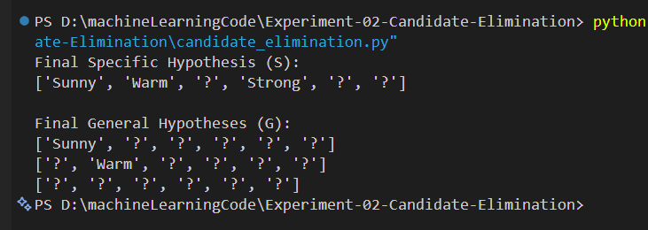

# Experiment 2 - Candidate Elimination Algorithm in Machine Learning (RTU)

## Aim
To implement and demonstrate the Candidate Elimination algorithm using a given set of training data samples.

---

## Introduction
Candidate Elimination algorithm is a concept learning algorithm that finds all hypotheses consistent with the training data. It maintains two sets:
- Specific boundary (S)
- General boundary (G)

---

## Algorithm Steps
1. Initialize S to most specific hypothesis
2. Initialize G to most general hypothesis
3. For each training example:
   - If positive:
     - Generalize S
     - Remove inconsistent hypotheses from G
   - If negative:
     - Specialize G
     - Remove inconsistent hypotheses from S
4. Output final S and G

---

## Dataset
Training data is stored in:
`Training_Data.csv`

---

## Implementation
The program is implemented in Python.

---

## How to Run

### Step 1: Install pandas
pip install pandas

### Step 2: Run program
python candidate_elimination.py

---

## Output

---

## Result
The Candidate Elimination algorithm successfully finds the version space by maintaining specific and general hypotheses.

---

## Keywords
Machine Learning, Candidate Elimination, RTU Lab, Python