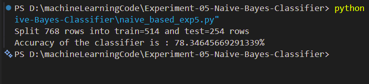

# Experiment 05 - Naïve Bayesian Classifier using Python

## Aim

Write a program to implement the naïve Bayesian classifier for a sample 
training data set stored as a .CSV file. Compute the accuracy of the classifier, 
considering few test data sets. 
---

## Objective

To understand the working of the Naïve Bayes classification algorithm and evaluate its performance on a given dataset using Python.

---

## Theory

Naïve Bayes is a probabilistic machine learning algorithm based on Bayes' Theorem. It assumes that all features are independent of each other given the class label.

Bayes' Theorem:

**P(C|X) = (P(X|C) × P(C)) / P(X)**

Where:

* P(C|X) = Posterior Probability
* P(X|C) = Likelihood
* P(C) = Prior Probability
* P(X) = Evidence

The classifier predicts the class having the highest posterior probability.

---

## Dataset

The training dataset is stored in:

```text
naivedata.csv
```

The dataset contains training examples used to build and evaluate the classifier.

---

## Files Included

* `naive_based_exp5.py` – Python implementation of Naïve Bayes Classifier
* `naivedata.csv` – Training dataset
* `output.png` – Output screenshot
* `README.md` – Experiment documentation

---

## Requirements

Install the required libraries:

```bash
pip install pandas scikit-learn
```

---

## How to Run

```bash
python naive_based_exp5.py
```

---

## Output



---

## Accuracy Evaluation

The classifier is trained using the given dataset and tested on sample records. The accuracy score is calculated to evaluate the performance of the model.

---

## Applications

* Email Spam Detection
* Sentiment Analysis
* Medical Diagnosis
* Text Classification
* Recommendation Systems

---

## Advantages

* Easy to implement
* Fast training and prediction
* Works well with large datasets
* Efficient for classification problems

---

## Result

The Naïve Bayesian Classifier was successfully implemented using Python. The model was trained using the dataset stored in a CSV file and its accuracy was computed using test data samples.

---

## Keywords

Machine Learning, Naïve Bayes, Bayesian Classifier, Python, RTU Lab Experiment, Classification Algorithm, Accuracy Evaluation
