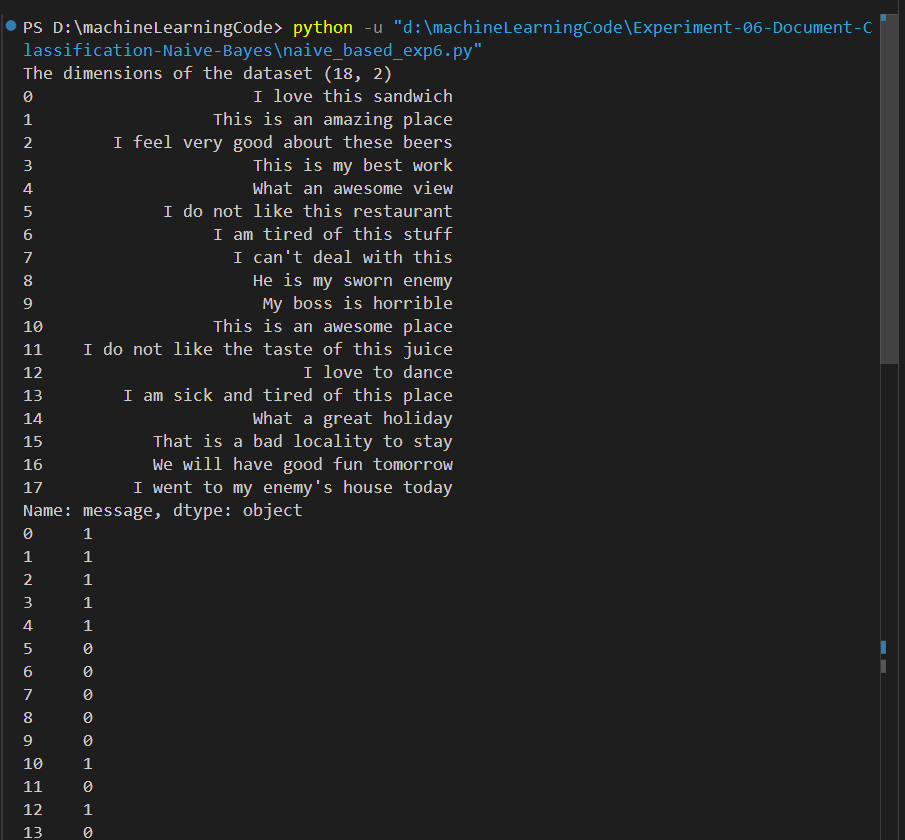
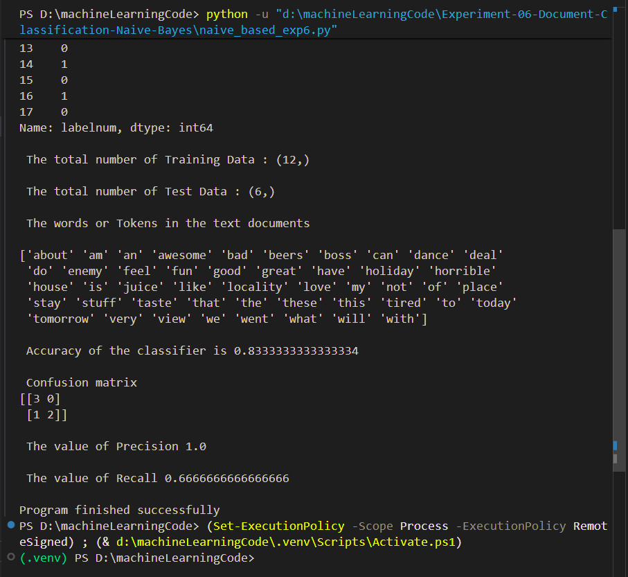

# Experiment 06 - Document Classification using Naïve Bayes Classifier

## Aim

Assuming a set of documents that need to be classified, use the naïve Bayesian 
Classifier model to perform this task. Built-in Java classes/API can be used to 
write the program. Calculate the accuracy, precision, and recall for your data 
set. 
---

## Objective

To implement document classification using the Naïve Bayes algorithm and evaluate its performance using standard classification metrics such as Accuracy, Precision, and Recall.

---

## Introduction

Document Classification is one of the most important applications of Machine Learning and Natural Language Processing (NLP). It involves automatically assigning documents to predefined categories based on their content.

Naïve Bayes is a probabilistic machine learning algorithm based on Bayes' Theorem. It is widely used for text classification because of its simplicity, efficiency, and high accuracy.

---

## Theory

Bayes' Theorem:

**P(C|D) = (P(D|C) × P(C)) / P(D)**

Where:

* **P(C|D)** = Posterior Probability
* **P(D|C)** = Likelihood
* **P(C)** = Prior Probability
* **P(D)** = Evidence

The classifier predicts the class that has the highest posterior probability.

---

## Dataset

Dataset File:

```text
naivetext.csv
```

The dataset contains sample text documents and their corresponding class labels used for training and testing the classifier.

---

## Files Included

* `naive_based_exp6.py` – Python implementation of Document Classification using Naïve Bayes
* `naivetext.csv` – Dataset used for training and testing
* `output_1.png` – Output screenshot showing classification results
* `output_2.png` – Output screenshot showing performance metrics
* `README.md` – Experiment documentation

---

## Requirements

Install the required Python libraries:

```bash
pip install pandas scikit-learn
```

---

## How to Run

Execute the program using:

```bash
python naive_based_exp6.py
```

---

## Performance Metrics

### Accuracy

Accuracy measures the percentage of correctly classified documents.

**Accuracy = (TP + TN) / (TP + TN + FP + FN)**

### Precision

Precision measures how many predicted positive documents are actually positive.

**Precision = TP / (TP + FP)**

### Recall

Recall measures how many actual positive documents are correctly identified.

**Recall = TP / (TP + FN)**

---

## Output Screenshots

### Classification Result



### Accuracy, Precision and Recall



---

## Applications

* Email Spam Detection
* News Classification
* Sentiment Analysis
* Text Categorization
* Document Organization
* Content Filtering

---

## Advantages

* Simple and easy to implement
* Fast training and prediction
* Effective for text classification
* Works well with large datasets
* Requires less training data

---

## Result

The Naïve Bayesian Classifier was successfully implemented for document classification. The model classified text documents and calculated Accuracy, Precision, and Recall metrics to evaluate its performance.

---

## Keywords

Machine Learning, Naïve Bayes, Document Classification, Text Classification, Accuracy, Precision, Recall, Python, RTU Lab Experiment
