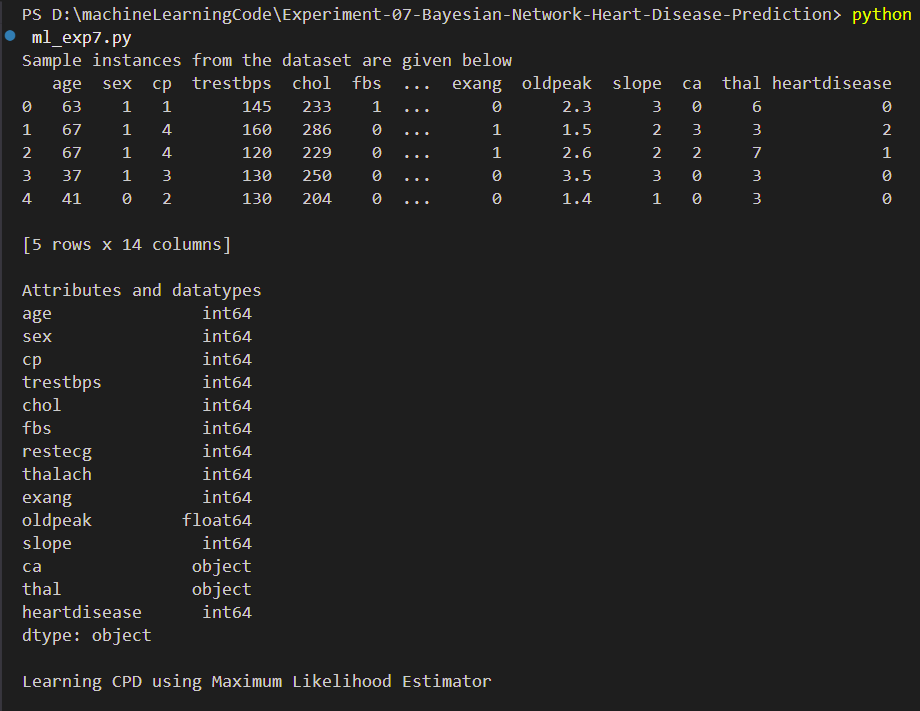
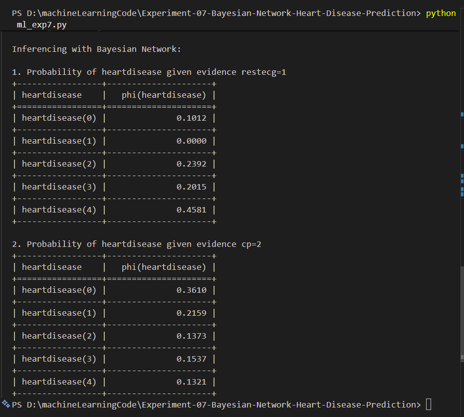

# Experiment 07 - Bayesian Network for Heart Disease Diagnosis

## Aim

To construct a Bayesian Network using medical data and demonstrate the diagnosis of heart disease patients using the standard Heart Disease Dataset.

---

## Objective

To understand the concept of Bayesian Networks and apply them to medical diagnosis using machine learning techniques and probabilistic reasoning.

---

## Introduction

Bayesian Networks are probabilistic graphical models that represent variables and their conditional dependencies using a Directed Acyclic Graph (DAG).

These networks are widely used in healthcare applications because they can model uncertainty and make predictions based on incomplete information.

In this experiment, a Bayesian Network is used to predict the presence of heart disease based on patient medical attributes.

---

## Theory

A Bayesian Network consists of:

* Nodes representing variables
* Directed edges representing dependencies
* Conditional Probability Tables (CPTs)

Bayes' Theorem:

**P(A|B) = (P(B|A) × P(A)) / P(B)**

Where:

* P(A|B) = Posterior Probability
* P(B|A) = Likelihood
* P(A) = Prior Probability
* P(B) = Evidence

The Bayesian Network uses these probabilities to infer whether a patient is likely to have heart disease.

---

## Dataset

Dataset File:

```text id="2e0hml"
heart.csv
```

The dataset contains medical records of patients with attributes such as:

* Age
* Sex
* Chest Pain Type
* Resting Blood Pressure
* Cholesterol
* Fasting Blood Sugar
* Resting ECG Results
* Maximum Heart Rate Achieved
* Exercise-Induced Angina
* ST Depression
* Heart Disease Status

---

## Files Included

* `ml_exp7.py` – Python implementation of Bayesian Network for Heart Disease Diagnosis
* `heart.csv` – Heart Disease Dataset
* `output_1.png` – Prediction output screenshot
* `output_2.png` – Model evaluation output screenshot
* `README.md` – Experiment documentation

---

## Requirements

Install the required Python libraries:

```bash id="1tzjv8"
pip install pandas numpy scikit-learn pgmpy
```

---

## How to Run

Execute the program using:

```bash id="h8w7vl"
python ml_exp7.py
```

---

## Output Screenshots

### Heart Disease Prediction



### Model Evaluation



---

## Applications

* Medical Diagnosis Systems
* Healthcare Analytics
* Disease Risk Prediction
* Clinical Decision Support Systems
* Expert Systems

---

## Advantages

* Handles uncertainty effectively
* Supports probabilistic reasoning
* Provides interpretable predictions
* Useful for medical diagnosis applications

---

## Result

The Bayesian Network model was successfully implemented using the Heart Disease Dataset. The model analyzed patient medical attributes and predicted the likelihood of heart disease using probabilistic inference.

---

## Keywords

Machine Learning, Bayesian Network, Heart Disease Prediction, Medical Diagnosis, Healthcare Analytics, Bayesian Inference, Python, RTU Lab Experiment
