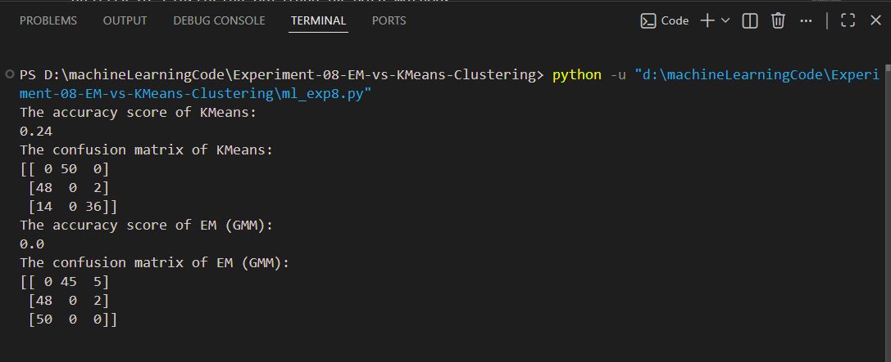
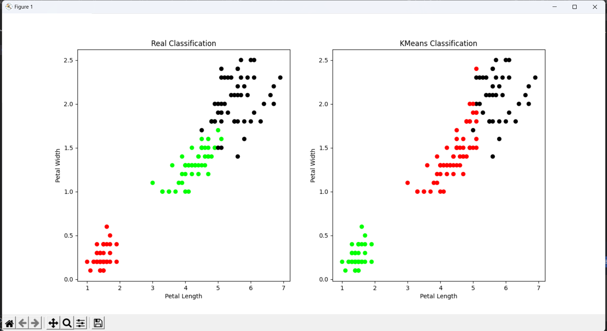
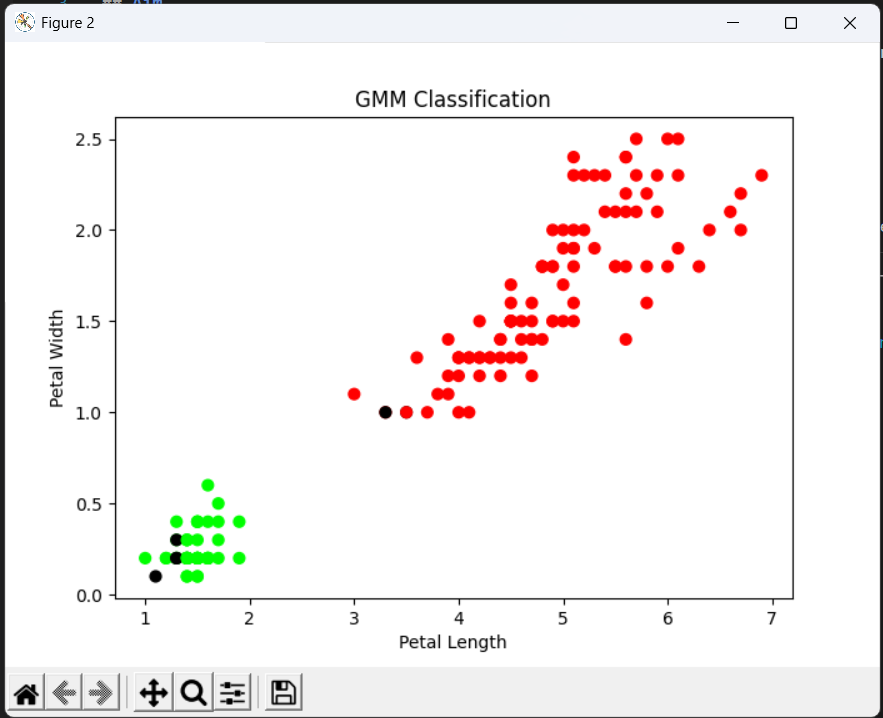

# Experiment 08 - EM Algorithm and K-Means Clustering Comparison

## Aim

Apply EM algorithm to cluster a set of data stored in a .CSV file. Use the same 
data set for clustering using k-Means algorithm. Compare the results of these 
two algorithms and comment on the quality of clustering. You can add 
Java/Python ML library classes/API in the program. 
---

## Objective

To understand the working of EM and K-Means clustering algorithms and evaluate the quality of clustering obtained by both methods.

---

## Introduction

Clustering is an unsupervised machine learning technique used to group similar data points together.

This experiment compares two popular clustering algorithms:

1. K-Means Clustering
2. Expectation Maximization (EM) Clustering using Gaussian Mixture Models (GMM)

The results are analyzed to determine which algorithm produces better clusters for the given dataset.

---

## Theory

### K-Means Clustering

K-Means partitions data into K clusters by minimizing the within-cluster sum of squares.

Steps:

1. Initialize K centroids
2. Assign points to nearest centroid
3. Update centroids
4. Repeat until convergence

---

### Expectation Maximization (EM)

EM is a probabilistic clustering algorithm that estimates parameters of Gaussian distributions.

Steps:

1. Expectation Step (E-Step)
2. Maximization Step (M-Step)
3. Repeat until convergence

EM can model clusters of different shapes and sizes more effectively than K-Means.

---

## Dataset

Dataset File:

```text id="r0tn7q"
clustering_data.csv
```

The dataset contains numerical attributes used for clustering analysis.

---

## Files Included

- ml_exp8.py – Python implementation of EM and K-Means clustering
- output_1.png – K-Means clustering result
- output_2.png – EM clustering result
- output_3.png – Comparison of clustering results
- README.md – Experiment documentation

## Output Screenshots

### K-Means Clustering


### EM Clustering


### Comparison Result


---

## Requirements

Install required libraries:

```bash id="g9jqlx"
pip install pandas numpy matplotlib scikit-learn
```

---

## How to Run

```bash id="ow6fw8"
python ml_exp8.py
```

## Comparison of Algorithms

| Feature       | K-Means        | EM Algorithm      |
| ------------- | -------------- | ----------------- |
| Type          | Distance-based | Probability-based |
| Cluster Shape | Spherical      | Flexible          |
| Speed         | Faster         | Slower            |
| Accuracy      | Moderate       | Higher            |
| Complexity    | Low            | High              |

---

## Quality of Clustering

* K-Means performs well when clusters are clearly separated and spherical.
* EM provides better clustering when data contains overlapping clusters.
* EM can capture complex cluster structures more effectively than K-Means.

---

## Applications

* Customer Segmentation
* Market Analysis
* Image Segmentation
* Pattern Recognition
* Data Mining

---

## Advantages

### K-Means

* Simple implementation
* Fast execution
* Efficient for large datasets

### EM Algorithm

* Handles uncertainty
* Flexible cluster shapes
* Better probabilistic interpretation

---

## Result

The dataset was clustered using both K-Means and EM algorithms. The clustering results were compared, and the quality of clusters was analyzed. EM generally produced more flexible and accurate clustering results compared to K-Means.

---

## Keywords

Machine Learning, Clustering, K-Means, Expectation Maximization, Gaussian Mixture Model, EM Algorithm, Data Mining, Python, RTU Lab Experiment
