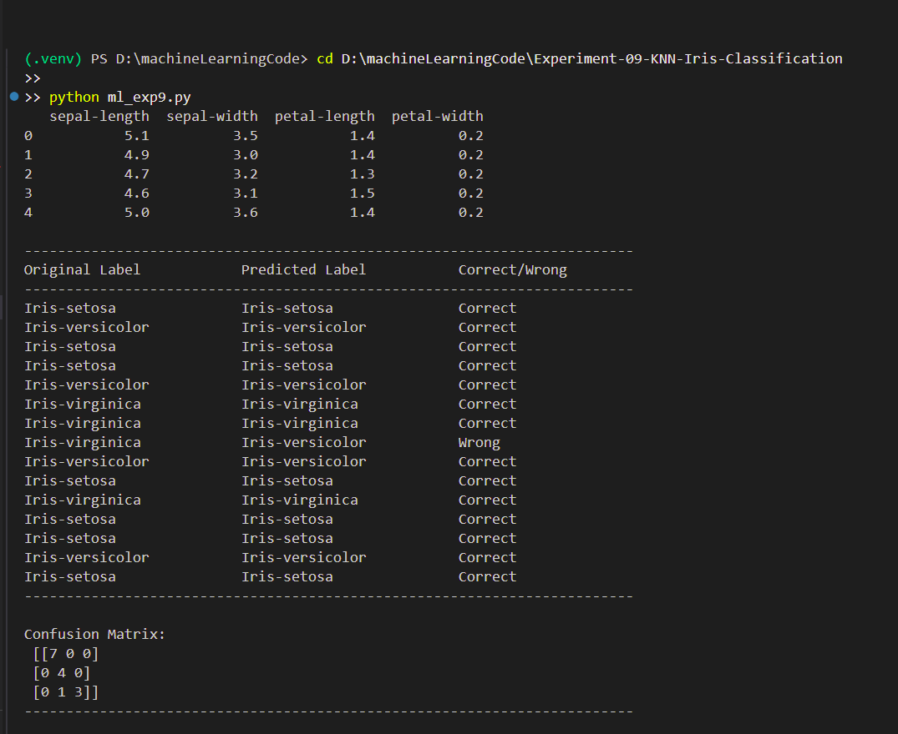
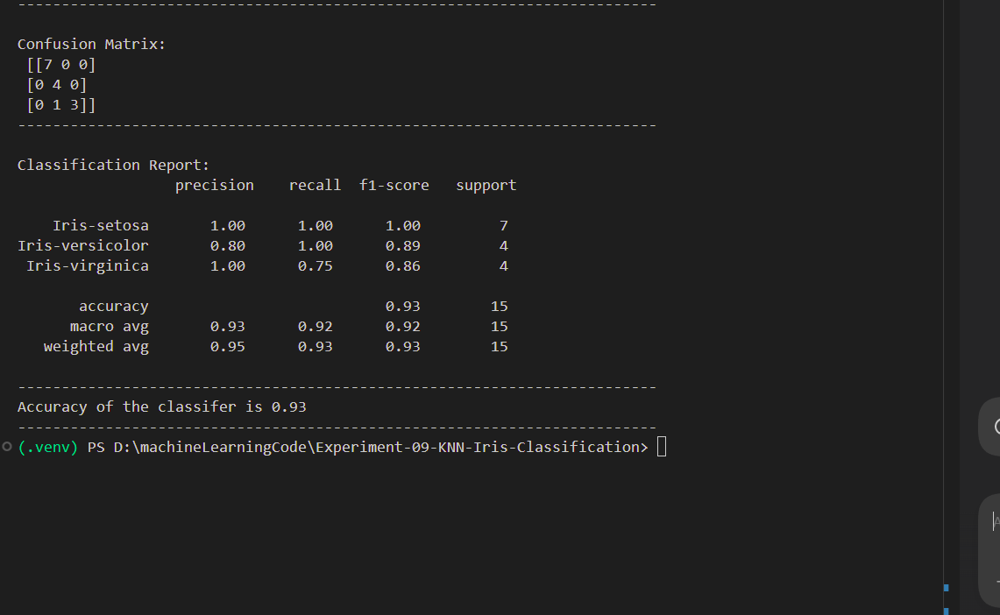

# Experiment 09 - K-Nearest Neighbour (KNN) Classification on Iris Dataset

## Aim

Write a program to implement k-Nearest Neighbour algorithm to classify the 
iris data set. Print both correct and wrong predictions. Java/Python ML library 
classes can be used for this problem.

---

## Objective

To understand and implement the KNN classification algorithm using the Iris dataset and evaluate its prediction performance.

---

## Introduction

K-Nearest Neighbour (KNN) is a supervised machine learning algorithm used for classification and regression tasks.

The algorithm classifies a new data point based on the majority class among its K nearest neighbors in the feature space.

The Iris dataset is one of the most popular datasets in machine learning and contains measurements of iris flowers belonging to three species:

* Iris Setosa
* Iris Versicolor
* Iris Virginica

---

## Theory

### K-Nearest Neighbour Algorithm

Steps:

1. Choose the value of K.
2. Calculate the distance between the test instance and all training instances.
3. Select the K nearest neighbors.
4. Determine the majority class among the neighbors.
5. Assign the majority class as the prediction.

Distance Formula (Euclidean Distance):

d = √[(x₂ - x₁)² + (y₂ - y₁)²]

---

## Dataset

Dataset File:

```text
iris.csv
```

Dataset Features:

* Sepal Length
* Sepal Width
* Petal Length
* Petal Width
* Species

---

## Files Included

* `ml_exp9.py` – Python implementation of KNN Classification
* `iris.csv` – Iris Dataset
* `output_1.png` – Correct predictions output
* `output_2.png` – Wrong predictions and accuracy output
* `README.md` – Experiment documentation

---

## Requirements

Install required libraries:

```bash
pip install pandas numpy scikit-learn matplotlib
```

---

## How to Run

```bash
python ml_exp9.py
```

---

## Output Screenshots

### Correct Predictions



### Wrong Predictions and Accuracy



---

## Applications

* Pattern Recognition
* Medical Diagnosis
* Recommendation Systems
* Image Classification
* Data Mining

---

## Advantages

* Simple and easy to implement
* No training phase required
* Effective for small datasets
* Works well for multi-class classification

---

## Limitations

* Computationally expensive for large datasets
* Sensitive to noisy data
* Requires proper choice of K value

---

## Result

The K-Nearest Neighbour (KNN) algorithm was successfully implemented on the Iris dataset. The model classified flower species and displayed both correct and incorrect predictions along with classification accuracy.

---

## Keywords

Machine Learning, KNN, K-Nearest Neighbour, Iris Dataset, Classification, Supervised Learning, Python, RTU Lab Experiment
